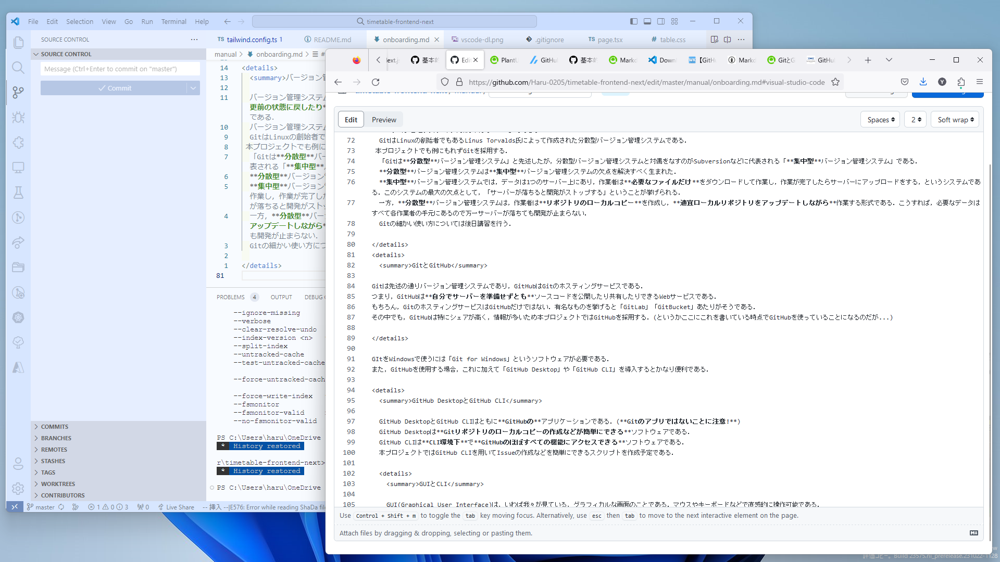
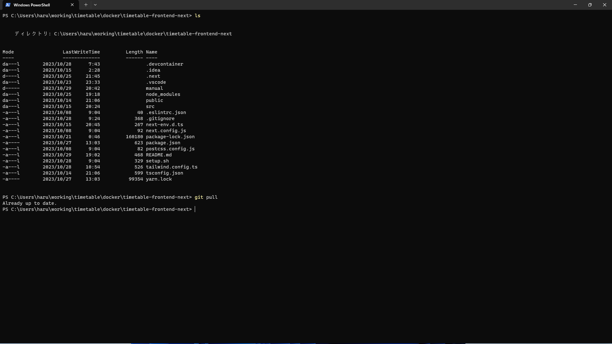
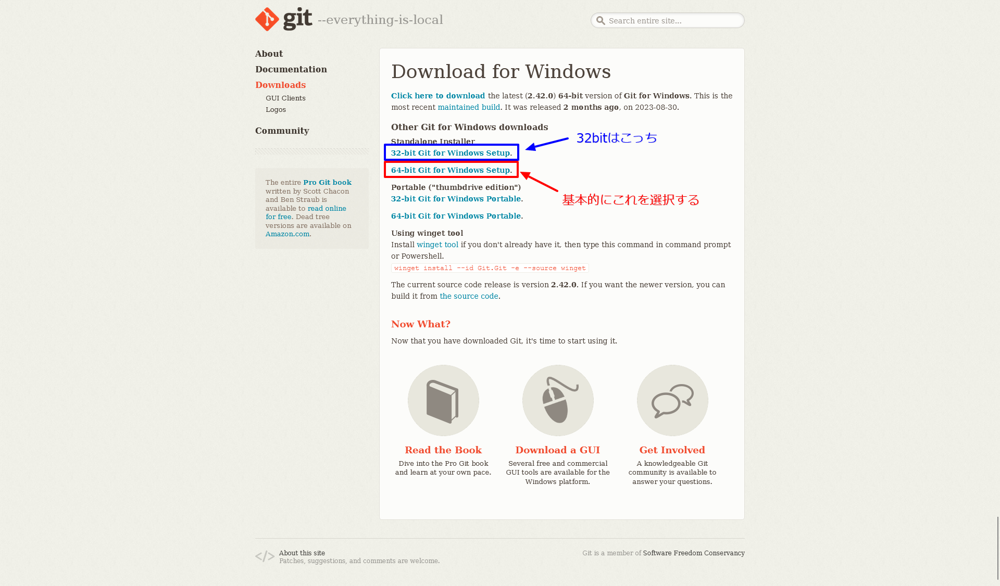
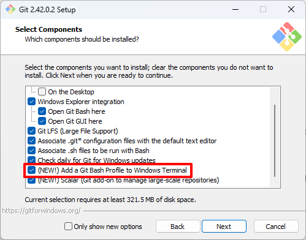
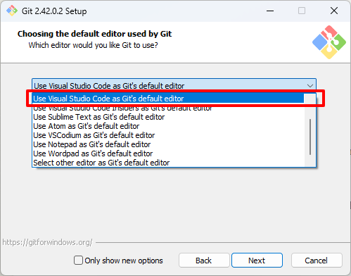
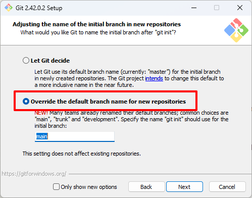
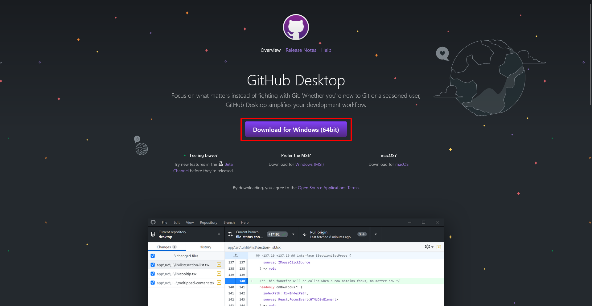
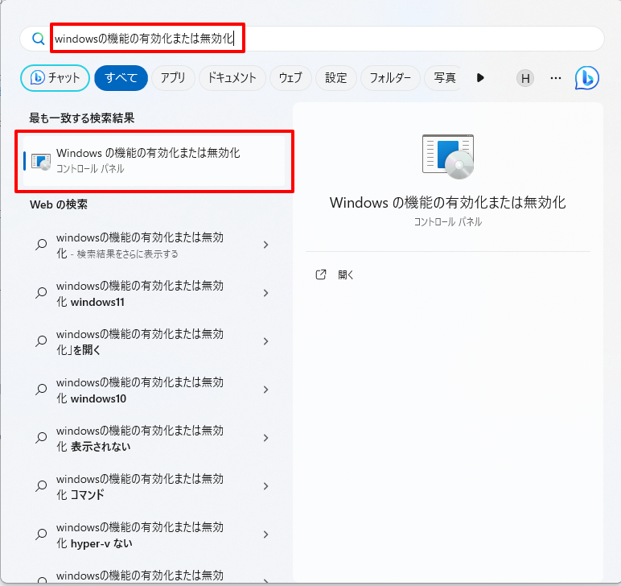
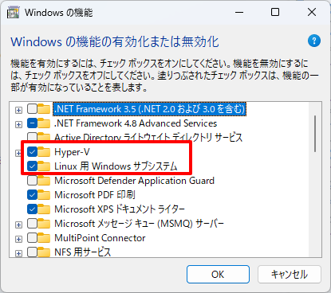
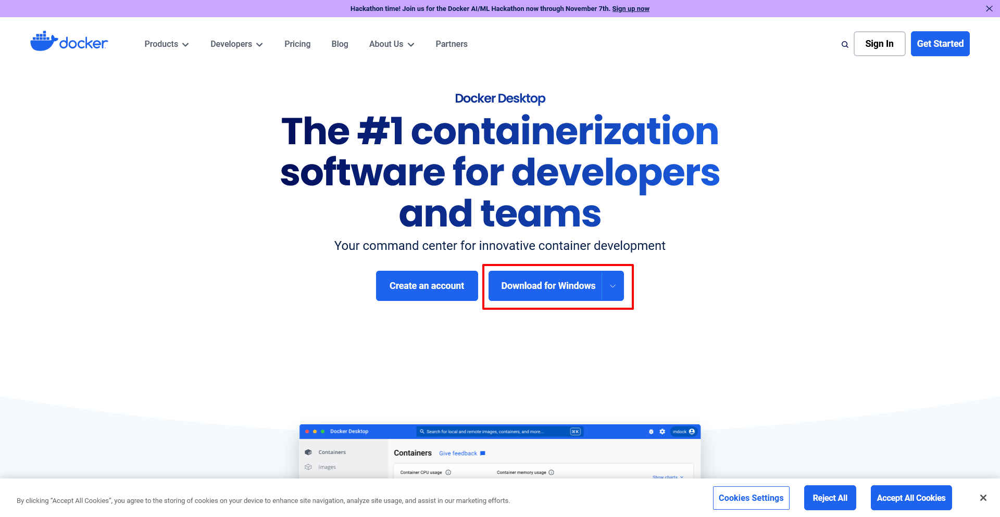

haru-0205/timetable-frontend-next

# 参加マニュアル

## マニュアルを読むにあたって(注意事項)

- このマニュアルは**Windows 11** がインストールされた PC を想定している．
  Mac や Linux,ChromeOS を使用している人は適宜読み替えること．
  なお，内容によっては折りたたんだ状態で記載することもある．
- 解説用の写真類については基本的に折りたたんである．
  必要なときは展開して確認すること．

## 必要なソフトウェアとそのインストール

本プロジェクトでは以下のツールを使用している．ゆえに，以下のソフトウェアのインストールが必要である．

> [!NOTE]
> すでにインストール済みの場合，再インストールは不要．
> (ただし，バージョンごとの差異が発生する可能性があるため，欠かさずアップデートすること．)

- [Visual Studio Code](#visual-studio-code) : コードエディター
- [Git for Windows](#git-for-windows) : バージョン管理ソフトウェア
- [GitHub Desktop](#github-desktop)：GitHub のデスクトップクライアント
- [Windows Subsystem for Linux](#windows-subsystem-for-linux) : Linux 環境(後述)
- [Docker Desktop](#docker-desktop) : コンテナー型仮想化ソフト(後述)
- Mozilla Firefox : ブラウザー

また，作業マニュアル等も GitHub にアップロードする予定であるため，以下のアプリケーションのインストールを推奨する．

- GitHub Mobile App (
  [Google Play](https://play.google.com/store/apps/details?id=com.github.android&pcampaignid=web_share),
  [App Store](https://apps.apple.com/jp/app/github/id1477376905))

## Visual Studio Code

### 概要

Visual Studio Code は「VSCode」と略されることが多い定番のテキストエディタ－である．  
これを制作したのは Microsoft 社であるが，オープンソースプロジェクトとして GitHub でソースコードを公開している．

### インストール

1. https://code.visualstudio.com/download から最新のビルドをダウンロードする．
2. ダウンロードしたインストーラーをダブルクリックして起動する．
3. インストーラーに沿ってインストールする．

> [!IMPORTANT]
> 手順 1 でダウンロードするのは特別な事情がない限り「Windows」とかかれたボタンをクリックすること．(fig.1)

 <details>
 <summary>fig.1</summary>
   
    
 
 </details>

なお，ここで紹介した方法以外に，WinGet を使ってもインストールできる．

```powershell
winget install --id Microsoft.VisualStudioCode
```

## Git for Windows

> [!NOTE]
> 原則入れることとするが，最悪入れなくてもどうにかなる．
> 入れない場合は，Windows 上でのちょっとした変更をやりにくくなる．

### 概要

Git は，現在(おそらく)最もシェアの高いバージョン管理システムである．

<details>
  <summary>バージョン管理システムについて</summary>
  
  バージョン管理システムは，**「いつ」「誰が」「どのファイルを」「どのように」変更したのかを記録**し， **必要に応じて変更前の状態に戻したり**，**1つのプロジェクトから分岐して別々に作業したり**,**それらを統合したりできる便利なシステム**である．  
  バージョン管理システムの筆頭はやはり「Git」であろう．  
  GitはLinuxの創始者でもあるLinus Torvalds氏によって作成された分散型バージョン管理システムである．  
 本プロジェクトでも例にもれずGitを採用する．  
  「Gitは**分散型**バージョン管理システム」と先述したが，分散型バージョン管理システムと対偶をなすのがSubversionなどに代表される「**集中型**バージョン管理システム」である．  
  **分散型**バージョン管理システムは**集中型**バージョン管理システムの欠点を解決すべく生まれた．  
  **集中型**バージョン管理システムでは，データは1つのサーバー上にあり，作業者は**必要なファイルだけ**をダウンロードして作業し，作業が完了したらサーバーにアップロードをする，というシステムである．このシステムの最大の欠点として，「サーバーが落ちると開発がストップする」ということが挙げられる．  
  一方，**分散型**バージョン管理システムは，作業者は**リポジトリのローカルコピー**を作成し，**適宜ローカルリポジトリをアップデートしながら**作業する形式である．こうすれば，必要なデータはすべて各作業者の手元にあるので万一サーバーが落ちても開発が止まらない．  
  Gitの細かい使い方については後日講習を行う．
  
</details>
<details>
  <summary>GitとGitHub</summary>

Git は先述の通りバージョン管理システムであり，GitHub は Git のホスティングサービスである．  
つまり，GitHub は**自分でサーバーを準備せずとも**ソースコードを公開したり共有したりできる Web サービスである．  
もちろん，Git のホスティングサービスは GitHub だけではない．有名なものを挙げると「GitLab」「GitBucket」あたりがそうである．  
その中でも，GitHub は特にシェアが高く，情報が多いため本プロジェクトでは GitHub を採用する．(というかここにこれを書いている時点で GitHub を使っていることになるのだが...)

</details>

GIt を Windows で使うには「Git for Windows」というソフトウェアが必要である．  
また，GitHub を使用する場合，これに加えて「GitHub Desktop」や「GitHub CLI」を導入するとかなり便利である．

<details>
  <summary>GitHub DesktopとGitHub CLI</summary>

GitHub Desktop と GitHub CLI はともに**GitHub の**アプリケーションである．(**Git のアプリではないことに注意!**)  
 GitHub Desktop は**Git リポジトリのローカルコピーの作成などが簡単にできる**ソフトウェアである．
GitHub CLI は**CLI 環境下**で**GitHub のほぼすべての機能にアクセスできる**ソフトウェアである．  
 本プロジェクトでは GitHub CLI を用いて Issue の作成などを簡単にできるスクリプトを作成予定である．

</details>
<details>
  <summary>GUIとCLI</summary>

GUI(Graphical User Interface)は，いわば我々が見ている，グラフィカルな画面のことである．マウスやキーボードなどで直感的に操作可能である．


CLI(Command Line Interface)は，(イメージとしては)真っ黒の画面にただ文字だけが表示されている画面である．基本的にキーボードのみで操作する．



なお，CLI は CUI:Command User Interface/Caractor-based User Interface ともいう．

</details>

### インストール

> [!IMPORTANT]
> Git のインストール前に Visual Studio Code のインストールを完了させることを強く推奨する．

1. https://git-scm.com/download/win から最新のビルドをダウンロード(fig.3)
2. ダウンロードしたインストーラーを起動
3. インストーラーに沿ってインストール  
    インストール時は以下のオプションを選択する. (以下の番号はインストーラーの「`Next`」を押した数+1)  
    1． `Next`(GPL ライセンス)  
    2． "Add a Git Bash Profile to Windows Terminal"に追加チェック->`Next`(fig.4)  
    3． "Use Visual Studio Code as ..."を選択->`Next`(意味が分かる人は別のものを選択してもよい)(fig.5)  
    4． "Override the default branch name ..."にチェック->`Next`(任意)(fig.6)  
    5-7． `Next`(デフォルト設定のままで OK)  
    8． "Checkout as-is, commit Unix-Style line encoding"にチェック->`Next`(fig.7)  
    9-12． `Next`(デフォルト設定のままで OK)  
    13． `Install`(デフォルト設定のままで OK)
   なお，これらの設定は間違えて設定しても修正可能である．
   また，Windows で Git を使う気がなければ極論すべてデフォルト設定でも問題はない．

<details>
  <summary>fig.3</summary>
  
  

</details>
<details>
  <summary>fig.4</summary>



</details>
<details>
  <summary>fig.5</summary>
  
  

</details>
<details>
  <summary>fig.6</summary>



</details>

また，もちろん Winget を使ってインストールすることもできる．

```powershell
winget install --id Git.Git
```

<details>
  <summary>設定修正・WinGet経由インストール時の設定用コマンド</summary>

- 改行文字設定

```bash
git config --system core.autocrlf input
```

- メールアドレス・ユーザー名設定

```bash
git config --global user.email #ここにメールアドレスを入力
git config --global user.name #ここにユーザー名を入力
```

- エディター設定(VSCode の場合)

```bash
git config --global core.editor 'code --wait'
```

- デフォルトブランチ(main にする場合)

```bash
git config --global init.defaultBranch main
```

</details>

## GitHub Desktop

> [!NOTE]
> これも入れると便利であるが，任意とする．
> ただし，Git を導入していないものは少なくともこちらは導入すること．

### 概要

GitHub Desktop は，言わずとも GitHub のデスクトップクライアントである．  
これを使うと，Git コマンドを使わずとも Git 関係の基本的な操作を行うことができる．  
ただし，VSCode の Git 統合機能は使えない．

### インストール

1. https://desktop.github.com/ からインストーラーをダウンロード(fig.8)
2. ダウンロードしたインストーラーを起動
3. インストーラーに沿ってインストール

<details>
  <summary>fig.8</summary>



</details>

例によって Winget でもインストールできる．

```powershell
winget install --id GitHub.GitHubDesktop
```

> [!NOTE]
> インストール完了後はログインしておくこと．

## Windows Subsystem for Linux

### 概要

Windows Subsystem for Linux (WSL)は，Windows 上で仮想的に Linux を動かすためのソフトウェアである．  
のちに説明する[Docker Desktop](#docker-desktop)で必要である．
また，任意の Linux ディストリビューションを入れて Linux コマンドを使用することもできる．

### 有効化

1. <kbd>win</kbd>+<kbd>Q</kbd>で検索画面を開き，`Windowsの機能の有効化または無効化`を検索，一番上に出てくるものをクリック (fig.9)
2. `Hyper-V` `Linux用Windowsサブシステム`にチェック (fig.10)
3. `OK`をクリック
4. 指示に従って再起動

<details>
  <summary>fig.9</summary>



</details>
<details>
  <summary>fig.10</summary>



</details>

## Docker Desktop

### 概要

Docker Desktop は，Docker Engine を Linux 以外でも動かせるようにするソフトウェアである．  
なお，これの動作には [WSL(Windows Subsystem for Linux)](#windows-subsystem-for-linux)が必要である．

### インストール

> [!WARNING]
> これをインストールする前にかならず[Windows Subsystem for Linux の設定](#windows-subsystem-for-linux)を行うこと．

1. https://www.docker.com/products/docker-desktop/ からインストーラーをダウンロードする．(fig.11)
2. ダウンロードしたインストーラーを起動する．
3. インストーラーに沿ってインストールする．
4. 指示に従って再起動する(要求されないこともある)．

<details>
  <summary>fig.11</summary>
  
  

</details>

言わずとも Winget でインストールすることもできる．

```powershell
winget install --id Docker.DockerDesktop
```

## Firefox

### 概要

Mozilla Firefox は，Mozilla Foundation が開発している Web ブラウザーである．  
Chrome や Microsoft Edge とは違うレンダリングエンジン(Web ページを表示するために解析する仕組み)を持つ，数少ないブラウザーの一つである．  
今回は CSS Grid を用いてレイアウトを組む予定であるため，CSS Grid ツール付きの DevTool が付属する Firefox を使用することを推奨する．

### インストール

ここでは Stable 版と Developer Edition 双方のインストール方法を示すが，今回は Stable 版で構わない(自分でも Web 開発をやりたい人は Developer Edition を推奨する)．

1. [Stable 版](https://www.mozilla.org/ja/firefox/new/)または[Developer Edition](https://www.mozilla.org/ja/firefox/developer/)をダウンロード
2. ダウンロードしたインストーラーを起動
3. インストーラーに沿ってインストール

もちろん，Winget でもインストール可能である．

- Stable 版

```powershell
winget install --id Mozilla.Firefox
```

- Developer Edition

```powershell
winget install --id Mozilla.Firefox.DeveloperEdition
```
